# 1.项目介绍
- 系统角色：管理员、商家、普通用户
- 功能模块：用户管理、商家管理、商品管理、商品类别、订单管理、咨询管理等
- 技术选型：SpringBoot，vue，MyBatis-plus等
- 测试环境：idea2024，jdk1.8，mysql5.7，maven3，redis5，Node14.16.1
# 2.项目部署
## 2.1 后端部署
- 创建数据库，导入sql文件
- idea打开目录springboot，根据本地数据库环境修改src/main/resources/application.yml  12-15行
- 启动项目 src/main/java/com/SpringbootSchemaApplication.java
## 2.2 管理端web
- idea（安装vue.js插件）或者webstorm、vscode等ide工具打开项目src/main/resources/admin/admin（直接通过cmd进入目录也行）
- 进入终端，输入 npm  install安装依赖（下载失败自行配置阿里的镜像加速）
- 启动项目 npm run serve
- 打开终端的地址，管理员账号密码：admin/admin   商家账号密码：22/222
## 2.3门户web（用户端web）
- idea（安装vue.js插件）或者webstorm、vscode等ide工具打开项目src/main/resources/front/front（直接通过cmd进入目录也行）
- 进入终端，输入 npm  install安装依赖（下载失败自行配置阿里的镜像加速）
- 启动项目 npm run serve
- 打开终端的地址，测试用户账号密码：111、111

# 3.项目部分截图
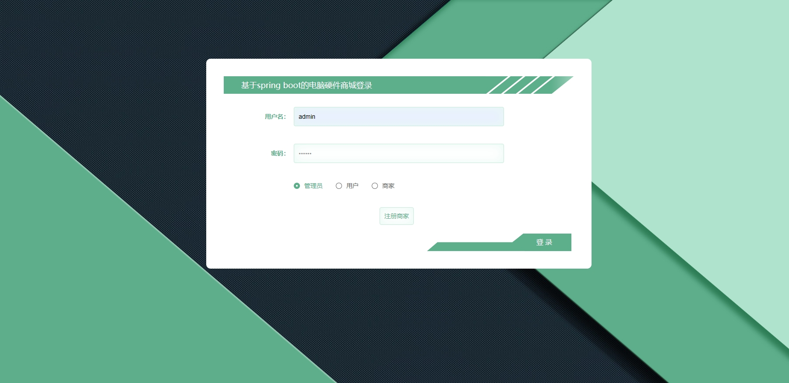
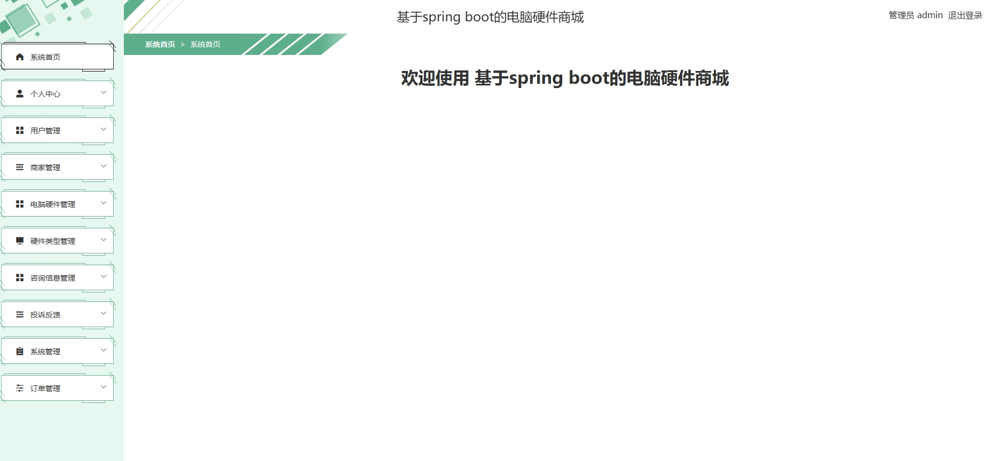
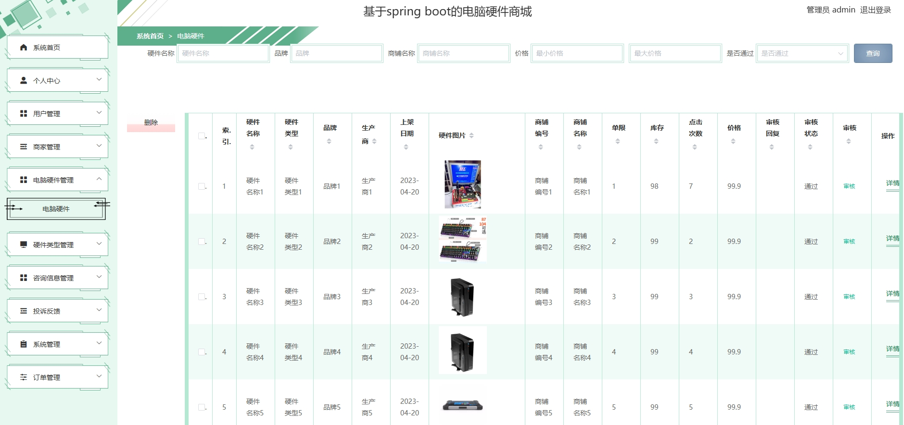
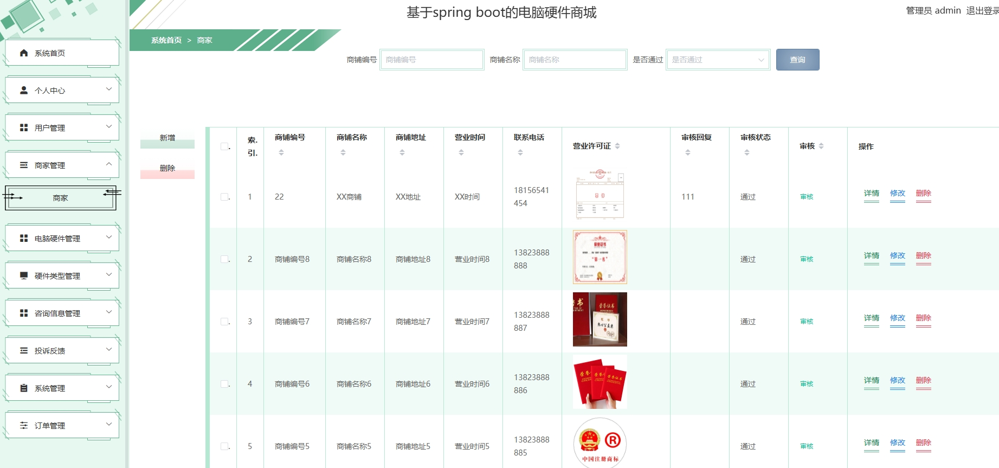
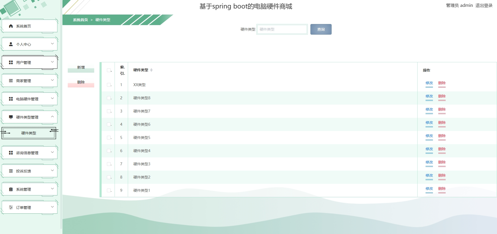
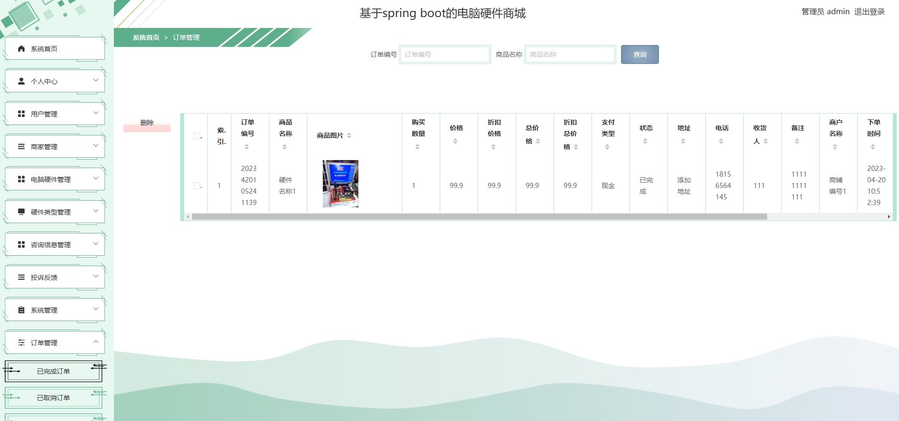

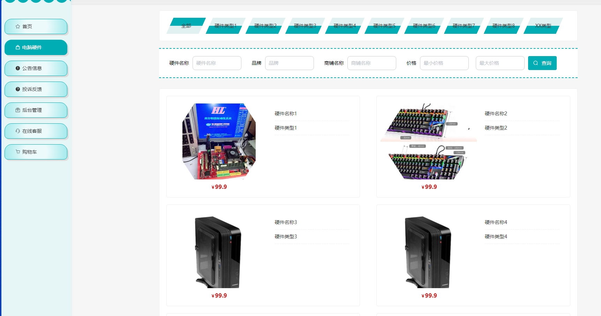
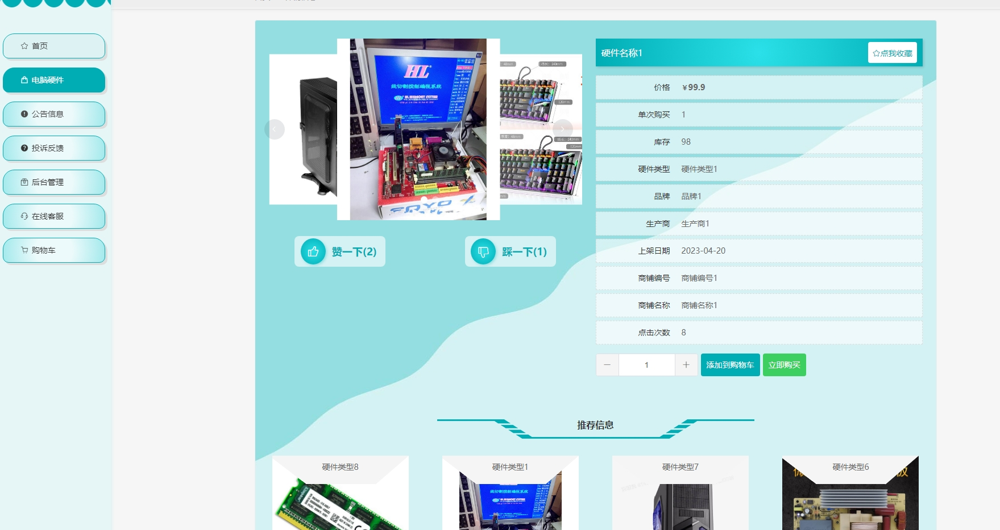
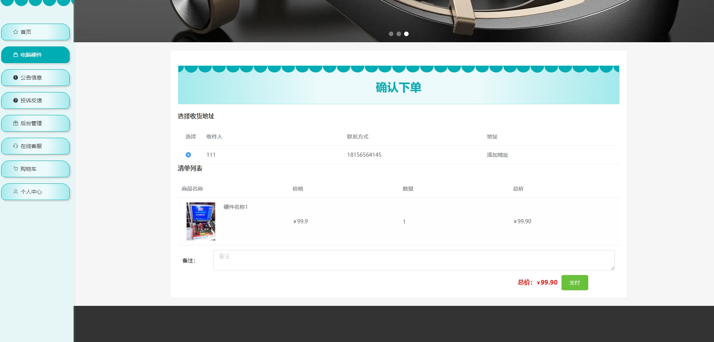
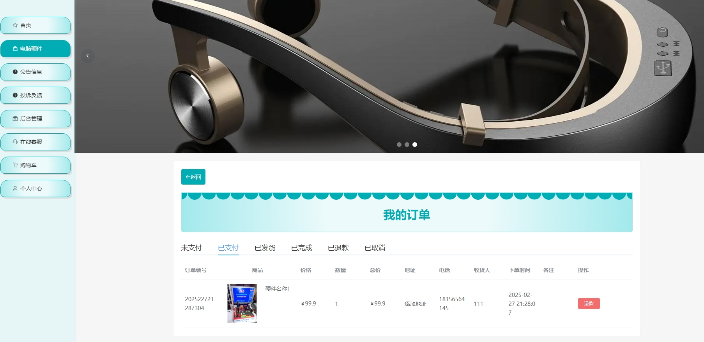
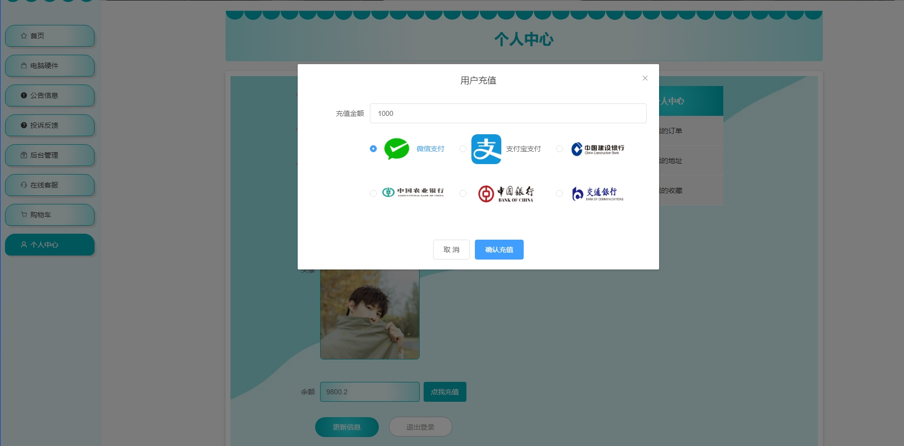
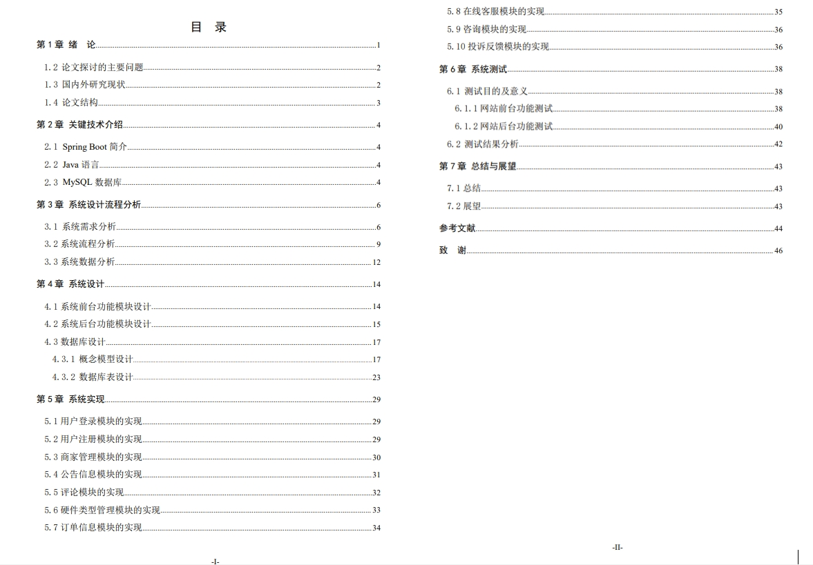

# 4.获取方式
[戳我查看](https://gitee.com/aven999/mall)
